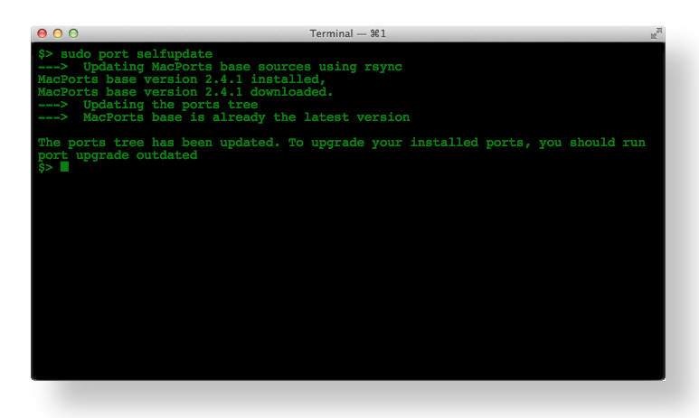

mcbTerminal
==============================================================================================

**Version** 0.0 alpha; Please report errors.

Free for personal and commercial use under the
[Creative Commons Attribution 4.0 License](https://creativecommons.org/licenses/by/4.0/)

Nice for websites to view OS X Terminal or Windows Console output. See [example](example.html) for a
preview.

Usage OS X
----------------------------------------------------------------------------------------------

### Classes

+ console
    + osx
        + root
    + win
        + root

For root add also `root` to class.

### Code
    <pre class="console osx">
      <code>$> sudo port selfupdate
    --->  Updating MacPorts base sources using rsync
    MacPorts base version 2.4.1 installed,
    MacPorts base version 2.4.1 downloaded.
    --->  Updating the ports tree
    --->  MacPorts base is already the latest version

    The ports tree has been updated. To upgrade your installed ports, you should run port upgrade outdated
    $> &#9608;
      </code>
    </pre>

### Results

